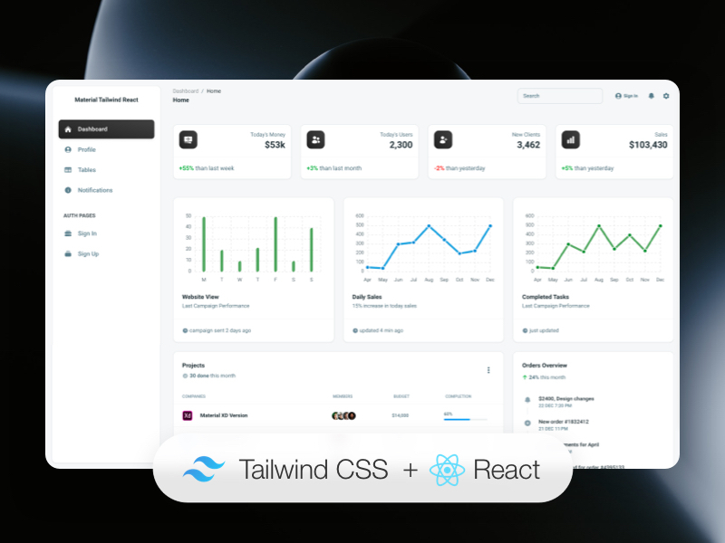

# [Material Tailwind Dashboard React](https://react-dashboard-v1.vercel.app?_vercel_share=tsJHRKBPGkyAPIXv39WE2h4OeqXpEW2k)



Material Tailwind Dashboard React is our newest free Material Tailwind Admin Template based on Tailwind CSS and React. If you’re a developer looking to create an admin dashboard that is developer-friendly, rich with features, and highly customisable, here is your match. Our innovative Material Tailwind, Tailwind CSS & React dashboard comes with a beautiful design inspired by Google's Material Design and it will help you create stunning websites & web apps to delight your clients.

**Fully Coded Elements**

Material Tailwind Dashboard React is built with over 40 frontend individual elements coming from @material-tailwind/react, like buttons, inputs, navbars, nav tabs, cards, or alerts, giving you the freedom of choosing and combining. All components can take variations in color, which you can easily modify using props and tailwind css classnames. You will save a lot of time going from prototyping to full-functional code because all elements are implemented.

This free Material Tailwind, Tailwind CSS & React Dashboard is coming with prebuilt design blocks, so the development process is seamless, switching from our pages to the real website is very easy to be done.

View [all components here](https://www.material-tailwind.com/docs/react/button).

**Documentation built by Developers**

Each element is well presented in very complex documentation.

You can read more about the [documentation here](https://www.material-tailwind.com/docs/react/installation).

**Example Pages**

If you want to get inspiration or just show something directly to your clients, you can jump-start your development with our pre-built example pages. You will be able to quickly set up the basic structure for your web project.

View [example pages here](https://react-dashboard-v1.vercel.app?_vercel_share=tsJHRKBPGkyAPIXv39WE2h4OeqXpEW2k/home).

**HELPFUL LINKS**

- View [Github Repository](https://github.com/Jacob-A11/react-dashboard)
- Check [FAQ Page](https://faq)

#### Special thanks

During the development of this dashboard, we have used many existing resources from awesome developers. We want to thank them for providing their tools open source:

- [Material Tailwind](https://material-tailwind.com/) - Material Tailwind is an easy to use components library for Tailwind CSS and Material Design.
- [Hero Icons](https://heroicons.com/) - Beautiful hand-crafted SVG icons.
- [Apex Charts](https://apexcharts.com/) - Modern & Interactive open-source Charts.
- [Nepcha Analytics](https://nepcha.com?ref=readme) for the analytics tool. Nepcha is already integrated with Material Tailwind Dashboard React. You can use it to gain insights into your sources of traffic.

Let us know your thoughts below. And good luck with development!

| React |
| ----- |

## Demo

- [Dashboard page](https://react-dashboard-v1.vercel.app?_vercel_share=tsJHRKBPGkyAPIXv39WE2h4OeqXpEW2k/home?ref=readme-mtdr)
- [Profile page](https://react-dashboard-v1.vercel.app?_vercel_share=tsJHRKBPGkyAPIXv39WE2h4OeqXpEW2k/profile?ref=readme-mtdr)
- [Tables page](https://react-dashboard-v1.vercel.app?_vercel_share=tsJHRKBPGkyAPIXv39WE2h4OeqXpEW2k/tables?ref=readme-mtdr)
- [Notifications page](https://react-dashboard-v1.vercel.app?_vercel_share=tsJHRKBPGkyAPIXv39WE2h4OeqXpEW2k/notifications?ref=readme-mtdr)
- [Sign in page](https://ex/#/auth/sign-in?ref=readme-mtdr)
- [Sign up page](https://ex/#/auth/sign-up?ref=readme-mtdr)

[View More](https://ex/#/?ref=readme-mtdr).

## Terminal Commands

1. Download and Install NodeJs LTS version from [NodeJs Official Page](https://nodejs.org/en/download/).
2. Navigate to the root ./ directory of the product and run `npm install` or `yarn install` or `pnpm install` to install our local dependencies.

### What's included

Within the download you'll find the following directories and files:

```
material-tailwind-dashboard-react
    ├── public
    │   ├── css
    │   └── img
    ├── src
    │   ├── configs
    │   ├── context
    │   ├── data
    │   ├── layouts
    │   ├── pages
    │   ├── widgets
    │   ├── App.jsx
    │   ├── main.jsx
    │   └── routes.jsx
    ├── .gitignore
    ├── CHANGELOG.md
    ├── index.html
    ├── ISSUE_TEMPLATE.md
    ├── jsconfig.json
    ├── LICENSE
    ├── package.json
    ├── postcsss.config.cjs
    ├── prettier.config.cjs
    ├── README.md
    ├── tailwind.config.cjs
    └── vite.config.js
```

## Browser Support

At present, we officially aim to support the last two versions of the following browsers:

## Technical Support or Questions

If you have questions or need help integrating the product please [contact us](https://contact-us?ref=readme-mtdr) instead of opening an issue.